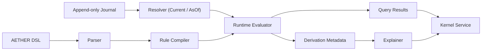

# Architecture Guide

AETHER is built as a semantic kernel, not as a pile of useful subsystems.

That distinction matters. The journal, resolver, compiler, runtime, explainer, and service boundary are not adjacent conveniences. They form one semantic path. AETHER is only coherent when those pieces line up.

## System Shape

The current implementation is easiest to understand as two flows that meet in the compiler and runtime:

- a data flow, where append-only datoms become resolved semantic state
- a program flow, where DSL-authored rules become executable plans

Those flows meet at evaluation time and then continue into query and explanation surfaces.

## Core Layers

### 1. Semantic substrate

The substrate is the part of the system that turns raw append-only history into semantic state.

It includes:

- datoms and identifiers in `aether_ast`
- schema and predicate registry behavior in `aether_schema`
- journal behavior in `aether_storage`
- deterministic `Current` and `AsOf` materialization in `aether_resolver`

The substrate is responsible for answering the question: “What is true in the journal at this cut of history?”

### 2. Rule compilation

The compiler is the part of the system that turns authored rules into an executable semantic plan.

It includes:

- DSL parsing
- predicate and fact validation
- rule safety checks
- dependency-graph construction
- SCC decomposition
- predicate-stratum calculation
- extensional binding inference

The compiler is responsible for answering the question: “How should these rules be evaluated, and what relationships exist among them?”

### 3. Runtime evaluation

The runtime is the part of the system that turns resolved state plus compiled rules into derived tuples.

It currently provides:

- semi-naive delta evaluation across recursive SCCs
- stratified negation across strata
- bounded aggregation for non-recursive grouped aggregate rules, including multiple aggregate terms per head
- materialized derived tuples
- conjunctive policy propagation from source facts into derived tuples and aggregate outputs
- iteration metadata
- parent tuple references
- source datom provenance
- query execution over derived and extensional relations

The runtime is responsible for answering the question: “Given this state and this program, what else becomes true?”

### 4. Explanation

The explainer is the part of the system that turns derived tuples back into legible evidence.

It currently reconstructs:

- tuple-local proof traces
- parent tuple structure
- source datom references

The explainer is responsible for answering the question: “Why is this derived tuple true?”

### 5. Service boundary

The current service boundary lives in `aether_api` as a stable request/response
surface with both in-memory and SQLite-backed kernel-service implementations plus
the pilot HTTP JSON boundary.

It is deliberately modest. Today it provides:

- append and history access
- `Current` and `AsOf` resolution
- parse, compile, evaluate, and explain flows
- end-to-end execution of DSL-authored documents
- authenticated tokens that bind endpoint scopes and maximum semantic policy visibility
- policy-aware explanation, derived-tuple filtering, visible-history replay, semantic audit context, and operator report generation that all stay inside the caller's effective policy cut
- artifact and vector sidecar federation for external artifact references, vector-match projection, and durable sidecar replay on the SQLite-backed path, with visibility anchored to real journal cuts
- a config-backed pilot service binary and packaged single-node deployment bundle with secret-file or env-backed token resolution

It is responsible for answering the question: “How does an external caller talk to the kernel without re-implementing its semantics?”

## End-to-End Request Lifecycle

The current happy path looks like this:

1. Append datoms to the journal.
2. Choose a semantic cut: `Current` or `AsOf(element)`.
3. Parse a whole-document DSL program.
4. Compile rules into an executable plan.
5. Resolve the journal into semantic state.
6. Evaluate the program over that state.
7. Query the resulting relations.
8. Explain any derived tuple that needs justification.

The demos in `examples/` and the service examples in `crates/aether_api/examples/` exercise that path directly.

## Semantic Invariants

These invariants are architectural, not incidental:

- For a fixed schema, journal prefix, and compiled program, results should be deterministic.
- Temporal replay is part of the semantics, not a debugging feature.
- Rust is the authoritative implementation of kernel semantics.
- Derived tuples should remain explainable.
- Process-boundary consumers may use results, but must not silently redefine them.

Any change that weakens one of these invariants is an architecture change and should be treated as such.

## Distributed Truth Stance

AETHER should not scale by forcing all semantic authority into one global log.

The correct distributed shape is:

- exact journal truth inside an authority partition
- deterministic replay and derivation inside that partition
- explicit imported facts with provenance across partitions

That means consensus is for source order, not for every derived answer.

Inside a partition, `Current` and `AsOf` remain exact against committed journal
prefixes. Across partitions, the honest model is a federated cut rather than a
fake global scalar element. Claims, leases, heartbeats, outcomes, and fencing
facts should stay inside one authority partition whenever possible so that safe
action remains a local semantic decision instead of a broad distributed
transaction.

Sidecars follow the same rule. Artifact and vector memory may widen
operationally, but they remain subordinate to committed journal history.

The first executable slice of that model now exists in the codebase:

- explicit `PartitionId`, `PartitionCut`, and `FederatedCut` types in the AST
- a single-process partition-aware in-memory service in `aether_api`
- exact local append/history/state reads per partition
- explicit federated-history reads over a cutset rather than a fake global cut
- imported facts that are lifted from partition-local query results with source partition/cut provenance
- federated document execution, tuple explain traces, and markdown reports that remain explicit about which local truths contributed to an answer
- a SQLite-backed partition-aware service that preserves those same semantics across service restarts

The longer-form strategy for this lives in
`docs/COMMERCIALIZATION/DISTRIBUTED_TRUTH.md`.
The governing ADR is
`docs/ADR/0001-authority-partitions-and-federated-cuts.md`.

## Current Boundaries

The current implementation line is intentionally clear:

- authoritative semantics live in Rust
- the DSL is the public semantic language
- Go and Python remain boundary layers, not semantic authorities
- journal storage is in-memory or SQLite-backed
- the kernel service is in-memory or SQLite-backed, with a minimal authenticated HTTP path plus a hardened packaged pilot-service startup path
- the partition-aware service slice now exists in both in-memory and SQLite-backed single-node forms, with imported-fact, federated-history, and federated explain/report semantics
- sidecar federation is implemented at the API boundary and durable on the SQLite-backed path, with registration and `AsOf` semantics subordinated to the kernel journal

This is not an omission of ambition. It is sequencing. The kernel is being made semantically credible before it is made infrastructurally broad.

## What Is Implemented Versus Deferred

### Implemented

- append-only journal behavior
- deterministic resolution
- strict v1 operation/class validation plus anchored sequence replay semantics
- whole-document DSL parsing for the current canonical v1 surface
- recursive and stratified runtime evaluation
- policy-aware derivation that propagates conjunctive visibility/capability requirements through derived tuples, aggregates, explains, and reports
- service-backed query and explanation
- bounded aggregation for the current non-recursive grouped slice
- policy-context-aware visibility filtering across datoms, DSL-authored facts, and sidecar reads/searches
- token-bound semantic policy ceilings on the authenticated HTTP path
- artifact and vector sidecar federation with provenance-bearing semantic fact projection, journal-tail-anchored registration, and SQLite-backed replay on the durable pilot path
- packaged pilot deployment and CI-enforced launch/drift gating around the single-node service path
- a first real Go operator shell plus typed Go client over the stable boundary
- a broader typed Python SDK surface over the stable boundary
- explicit partition and federated-cut types plus a single-process partition-aware in-memory service
- imported-fact reasoning plus federated explain/report surfaces over that partition-aware service
- a durable SQLite-backed partition-aware backend for single-node replay across multiple partitions
- operator-facing demonstrations
- a tracked semantic compliance matrix for the current v1 single-node closure claim

### Deferred

- broader post-v1 DSL ergonomics
- replicated or failover-capable partition-aware backends
- distributed or replicated sidecar federation backends
- production-hardened multi-tenant service boundaries
- mature Go/Python client ecosystems beyond the current first real boundary clients

Those deferrals are deliberate. They keep the semantic center stable while the kernel is still proving itself.

## How To Read The Code

The most productive code-reading order is:

1. `crates/aether_ast`
2. `crates/aether_storage`
3. `crates/aether_resolver`
4. `crates/aether_rules`
5. `crates/aether_runtime`
6. `crates/aether_explain`
7. `crates/aether_api`

That order follows the actual direction of data and meaning.

## Related Guides

- `docs/GLOSSARY.md` defines the vocabulary used here.
- `docs/DEVELOPER_WORKFLOW.md` explains how to change this architecture safely.
- `docs/OPERATIONS.md` explains how operators exercise the current system.
