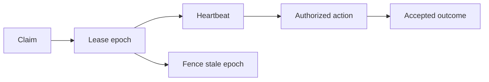
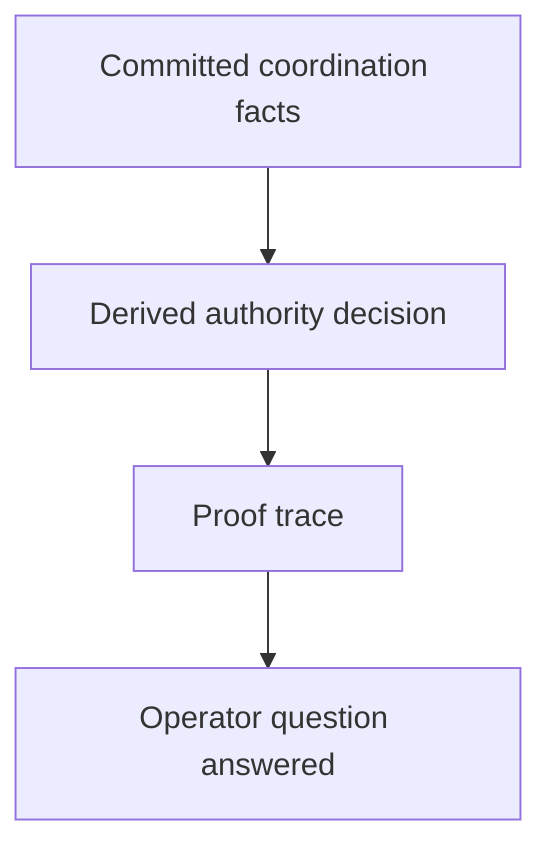

# Coordination, Authority, And Proof

It is one thing to know that something is true.
It is another to know who is allowed to act on it.

AETHER cares about both.

That is why coordination is not treated as a side note.
Claims, leases, heartbeats, outcomes, and fencing are part of the semantic
model itself.

## A Simple Question

Suppose two workers both think they own the same task.

Who is right?

If your system answers this by shrugging at a queue timestamp and hoping for the
best, trouble is on the way.

AETHER instead tries to derive the answer from durable facts.

## The Everyday Analogy

Picture a machine room with a physical key.

- claiming the task is like signing out the key
- the lease epoch is like the numbered tag on the key ring
- heartbeats are like periodic radio calls saying the operator is still present
- outcomes are the signed completion notes
- fencing is the lock refusing an old key after the ring has been reissued

That is a mundane picture, and that is why it helps.

## Figure: Safe Action

The point is not that these words are clever.
The point is that the decision path is visible.

## A Worked Example

Suppose the journal says:

1. task 1 claimed by worker A
2. task 1 lease epoch 1
3. heartbeat from worker A
4. task 1 claimed by worker B
5. task 1 lease epoch 2
6. heartbeat from worker B

Now A tries to report completion.

AETHER can say:

- worker A once had authority
- worker B now has authority
- worker A's outcome is stale and fenced

And because the system keeps provenance, it can show why.

## Why Proof Matters

People often imagine explanation as a luxury.
It is not.

In coordination systems, proof is practical.

It lets you answer:

- why was this task blocked?
- why was this worker allowed to act?
- why was that result rejected?
- what source facts caused this decision?

Without proof, every dispute becomes archaeology.

With proof, the system can point to the chain.

## Figure: From Authority To Explanation

## The Large Point

AETHER is not trying merely to automate work.
It is trying to automate work in a way that stays legible.

That is why coordination and explanation belong together.

The system should not merely say:

- accepted
- rejected

It should be able to say:

- accepted because the live lease holder heartbeated at the relevant cut
- rejected because the reported outcome came from a stale epoch

That difference is what turns automation from a black box into something people
can govern.
