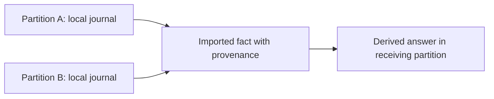
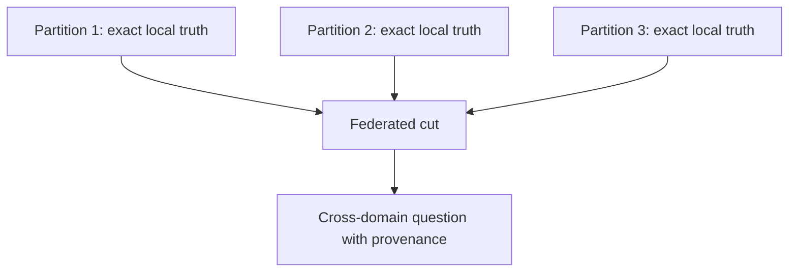

# Federated Truth

The temptation in distributed systems is always the same:

try to pretend the whole world is one room.

If everything could be poured into one giant ordered stream, perhaps the system
would feel simple.

But much of that simplicity would be an illusion.

AETHER takes a different view.

Not one giant truth.
A fabric of exact local truths.

## What That Means In Plain Talk

Each real domain of authority should keep its own exact record.

A tenant.
A workspace.
An incident.
A case.
A regional operation.

Inside each of those domains, truth should be exact and replayable.

Across domains, truth should be carried explicitly, with provenance, rather
than blurred into one fake global picture.

## A Civic Analogy

Think of a federation of cities.

Each city keeps its own register of streets, permits, inspectors, and utility
work.
That local register needs to be exact.

But cities also share facts:

- one road closure affects a regional route
- one port authority affects inland logistics
- one inspection result affects a partner facility

The answer is not to abolish the cities and force every local event into one
planetary ledger.
The answer is to keep local authority exact and make shared facts explicit.

That is the intuition behind federated truth.

## Figure: Local Truth And Imported Fact

## Why This Is More Honest

If a read spans several partitions, AETHER should not pretend there is one
magic global `AsOf`.

Instead, it should say which cut was used in each place.

For example:

- tenant A at one committed cut
- tenant B at another committed cut
- sidecar memory anchored to its own partition cut

This is slightly more explicit.
It is also vastly more truthful.

## The Operator's Benefit

Federated truth lets an operator ask:

- which domain told us this?
- at what cut was that fact imported?
- which local truths contributed to the final answer?

That matters because distributed systems fail in the cracks between domains.

If those cracks are hidden, operations become superstition.
If those cracks are visible, operations become governable.

## Figure: Exact Local Truths

## The Technical Phrase, Now That The Shape Is Clear

The formal language is:

- authority partitions
- federated cuts
- imported facts with provenance

But the plain-language idea is better to learn first:

let each place keep exact truth locally, then combine those truths honestly.

## Why This Fits AETHER

AETHER is trying to become a semantic coordination fabric.

That means it cannot merely be distributed.
It must be distributed in a way that preserves:

- exact replay
- derived meaning
- safe authority
- proof

Federated truth is the scaling form that protects those properties instead of
trading them away.
