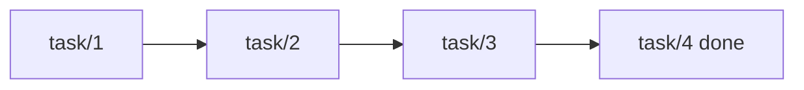
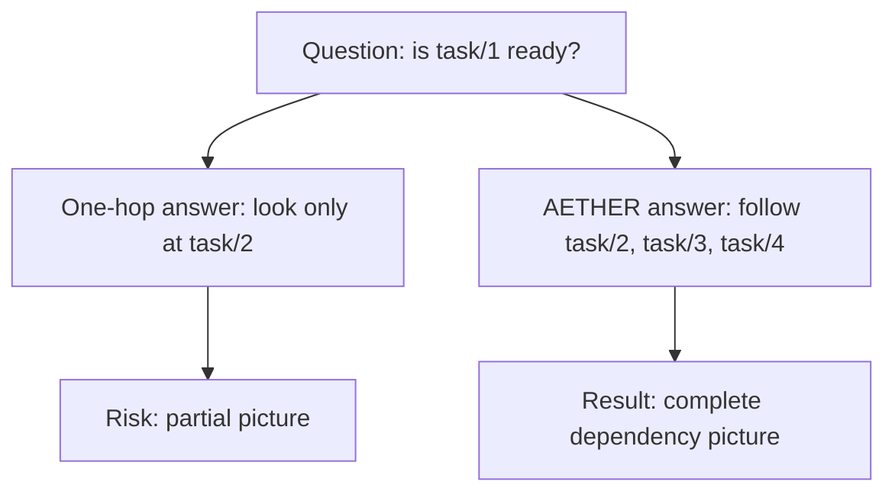

# Recursive Closure

This is the idea people often fear most because the phrase sounds like a
mathematics lecture.

In ordinary speech, recursive closure means something simpler:

follow the whole chain until there is nothing relevant left out.

That is all.

## A Ladder Of Dependencies

Suppose:

- task 1 depends on task 2
- task 2 depends on task 3
- task 3 depends on task 4
- task 4 is done

If you only inspect one step, you may miss the real answer.
If you follow the chain all the way down, the situation becomes clear.

Recursive closure is what lets AETHER keep following that line until the
picture is complete.

## Why One Step Is Not Enough

Many systems are quite good at the first hop.

They can say:

- task 1 depends on task 2

But the important question is usually:

- and what does task 2 depend on?
- and then what?
- and is the whole chain clear?

AETHER keeps asking "and then what?" until it stops finding new relevant facts.

## A Friendly Analogy

Imagine trying to find out whether a package can leave a warehouse.

You check the box.
The box depends on a pallet.
The pallet depends on a customs document.
The customs document depends on an inspection.

If you stop after one step, you may think the package is ready when it is not.

Recursive closure is the discipline of not stopping too early.

## Figure: One-Hop Thinking Versus Full-Chain Thinking

## The Technical Name, After The Intuition

Now that the shape is plain, we can say the formal phrase.

Computer scientists call this recursive closure.

The kernel repeatedly applies rules until no new relevant truths appear.

That sounds more intimidating than it is.
In practice it means:

- keep following the consequences
- stop only when the picture is complete

## Why It Matters Commercially

This is not an academic flourish.
It matters in live systems because readiness, authority, policy inheritance, and
consequence often depend on more than one fact and more than one hop.

If you want a system to make decisions people can trust, one-hop reasoning is
often not enough.

Recursive closure is what turns a partial answer into a dependable one.
