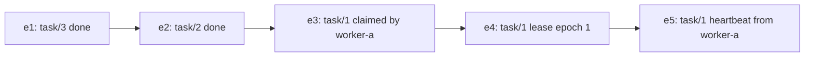
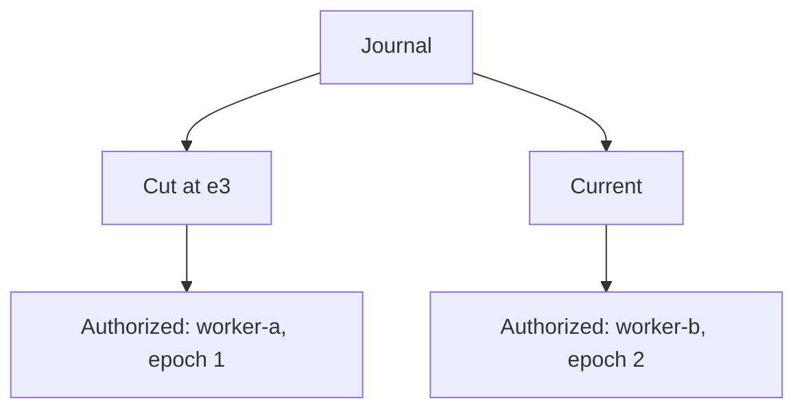

# Time Cuts And Memory

The first unusual thing about AETHER is that it treats time as part of the
meaning, not as a decorative property.

Most systems answer:

- what is true now?

AETHER also answers:

- what was true at this exact point in the journal?

That second question matters more than many people realize.

## A Film Reel, Not A Whiteboard

Imagine two ways of keeping a record.

On a whiteboard, you erase the old note and write the new one.
At the end, you only know the latest state.

On a film reel, every frame is kept.
If you want to know what was happening twelve seconds ago, you can go to that
frame.

AETHER behaves more like the reel than the whiteboard.

Each event becomes part of the journal.
Nothing is quietly overwritten.

## Two Important Questions

AETHER's resolver answers two related questions.

### `Current`

"Given everything committed so far, what is true now?"

### `AsOf`

"Given the journal only up to this exact event, what was true then?"

This sounds modest until you need to reconstruct a disputed decision.

## A Concrete Example

Suppose the journal says:

1. task 1 is claimed by worker A
2. task 1 lease epoch is 1
3. heartbeat arrives from worker A
4. task 1 is claimed by worker B
5. task 1 lease epoch is 2

Now ask two questions.

At `AsOf(e3)`, who may act?
The answer is worker A.

At `Current`, who may act?
The answer is worker B.

Without exact time cuts, these two answers blur together into confusion.

## Figure: Why `AsOf` Matters

## The Everyday Analogy

Think of a bank statement.

If you ask, "What is my balance now?" you get one answer.
If you ask, "What was my balance just before the rent payment cleared?" you get
another.

Neither answer is strange.
What would be strange is a bank that could not answer the second question at
all.

AETHER applies the same principle to coordination.

## Why This Is Useful In Operations

Time cuts help with:

- disputes about who was authorized at the moment of action
- incident review
- replaying stale or unsafe behavior
- comparing what changed between two semantic cuts
- proving that the system did not merely guess after the fact

In plain terms:

`Current` tells you where you stand.
`AsOf` tells you how you got here.

And once you can trust both, the rest of the system becomes much easier to
trust as well.
