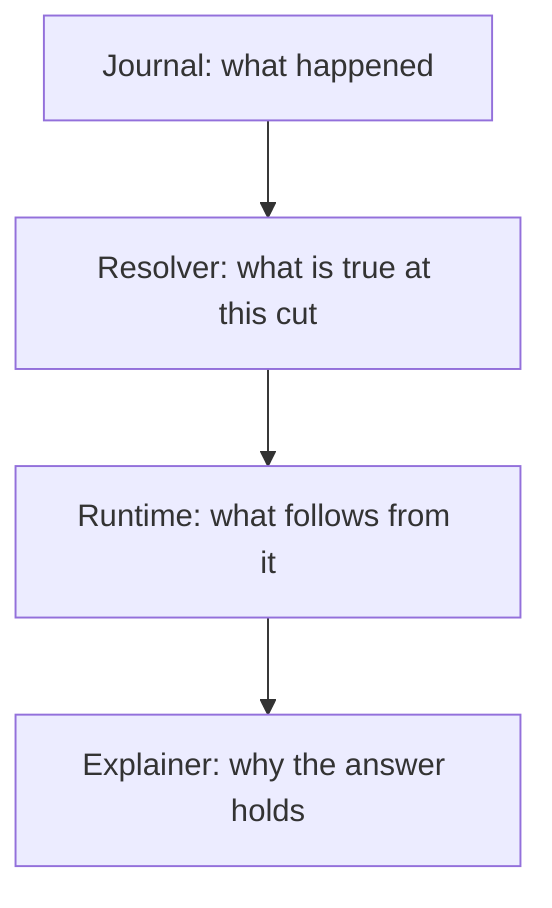
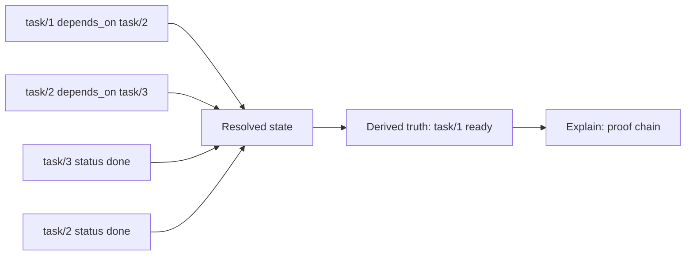

# What AETHER Is

Suppose you had to run a busy harbor.

Ships arrive. Cargo changes hands. Orders are amended. Storms roll in. Crews
swap. Some boats may leave, some must wait, and some must not move at all until
three other things happen first.

You could keep this in people's heads.
You could keep part of it in a logbook.
You could keep part of it in a whiteboard.
You could keep part of it in an email thread.

That is how confusion begins.

AETHER is an attempt to build the opposite of that confusion.

It is a system that keeps a durable memory of what happened, works out what
those facts imply, decides who may act, and keeps the proof of why it reached
that conclusion.

## The Plain Version

AETHER is a semantic coordination fabric.

That phrase sounds grand, so let us make it ordinary.

It means:

- it remembers facts
- it works out consequences
- it keeps track of authority
- it can explain its answers

The easiest way to picture it is as four layers stacked on top of one another.

## A Familiar Analogy

Imagine four people in a room.

The first writes down every event in order and refuses to erase anything.
That is the journal.

The second is asked, "At noon yesterday, what was the situation?"
That is the resolver.

The third looks at that situation and says, "If these things are true, then
these other things must also be true."
That is the runtime.

The fourth says, "Show me the chain of reasons."
That is the explainer.

Many systems have one or two of these people.
AETHER wants all four at once.

## Why This Matters

Most modern systems are good at one part of the story and weak at the others.

- databases remember facts, but often do not derive enough from them
- workflow engines move work, but often cannot explain the full chain of cause
- vector stores retrieve memory, but often cannot say who may act
- agent frameworks act fluently, but often struggle to say why the action was
  truly authorized

AETHER tries to bring those pieces into one coherent surface.

## A Tiny Example

Suppose the facts are:

- task 1 depends on task 2
- task 2 depends on task 3
- task 3 is done
- task 2 is done

Then AETHER can tell you:

- task 1 is ready

But it does not stop there.
It can also tell you:

- task 1 is ready because task 2 is done
- task 2 is done and depended on task 3
- task 3 is done

That is the difference between a system that merely emits a result and a system
that preserves the reasoning behind the result.

## Figure: From Events To Meaning

## The One-Sentence Version

AETHER is a machine for operational truth.

Not just "run this workflow."
Not just "store this memory."
But:

- remember what happened
- determine what is true now
- derive what follows
- decide who may act
- preserve the proof

That is the foundation for everything else in this set.
