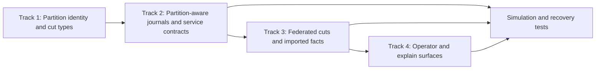

# Federated Truth Implementation Plan

This document turns the distributed-truth doctrine into buildable work.

The target is not a vague "distributed AETHER."
The target is the first disciplined implementation of:

- authority partitions
- partition-local exact replay
- federated cuts
- imported facts with provenance

The governing architectural decision is
`docs/ADR/0001-authority-partitions-and-federated-cuts.md`.

## 1. Goal

Introduce the first partition-aware semantic model without weakening the kernel:

- local truth stays exact
- multi-partition reads become explicit
- cross-domain facts stay attributable
- safe coordination remains local whenever possible

## 2. Non-Negotiable Invariants

This slice must preserve:

- deterministic answers for a fixed partition cut and program
- exact `Current` and `AsOf` semantics inside a partition
- explainable derivations
- journal-subordinated sidecar visibility
- clear provenance for imported facts
- no fake global scalar time

## 3. Execution Shape

The implementation should proceed in four tracks that land in order.

## 4. Track 1: Partition Identity And Cut Types

### Objective

Make partition identity explicit in the semantic and service model.

### Deliverables

- add a partition identifier type in `aether_ast`
- add a partition-qualified cut representation
- add a federated-cut representation for multi-partition reads
- distinguish local cuts from federated cuts in the API surface

### Notes

This is mostly type-system work and request/response design.
It should land before storage or service changes so that later work has the
right shape to target.

### Expected crate touch points

- `crates/aether_ast`
- `crates/aether_api`
- `crates/aether_explain`

## 5. Track 2: Partition-Aware Journals And Service Contracts

### Objective

Make journals and service calls partition-aware without yet promising a full
distributed deployment.

### Deliverables

- journal traits that can address a partition explicitly
- durable partition-local append and prefix replay
- service endpoints that can target one partition or a federated cutset
- partition-aware audit records

### Execution note

The first implementation can still be single-process and even single-node. The
important thing is that partition boundaries become explicit in the model and
the wire contract.

### Expected crate touch points

- `crates/aether_storage`
- `crates/aether_resolver`
- `crates/aether_api`

## 6. Track 3: Federated Cuts And Imported Facts

### Objective

Introduce honest cross-partition reasoning.

### Deliverables

- federated cutset evaluation entry points
- imported-fact structures with provenance
- runtime support for extensional imported relations
- explain metadata that can name the source partition and source cut

### Rule

Imported facts are not anonymous extensional input.
They are attributed semantic input.

### Current status

The first executable Track 3 slice now exists:

- partition-local query results can be lifted into imported extensional facts
- imported facts carry source partition/cut provenance into derived tuples
- federated document execution can join imported facts without inventing a global scalar time
- tuple explain traces and markdown reports now surface contributing partition cuts explicitly

The remaining work in this track is durability and broader service posture, not
the basic semantic model.

Track 3 now also runs over the first durable partition-aware backend:

- a SQLite-backed partition service can replay local truth after restart
- imported-fact, federated explain, and federated report semantics survive that restart intact

### Expected crate touch points

- `crates/aether_ast`
- `crates/aether_rules`
- `crates/aether_runtime`
- `crates/aether_explain`
- `crates/aether_api`

## 7. Track 4: Operator And Explain Surfaces

### Objective

Make federated truth legible.

### Deliverables

- operator reports that show which partitions and cuts contributed to an answer
- explain output that distinguishes local truth from imported truth
- demo/report surfaces that make federated time intelligible rather than hidden

### Notes

This is where the architecture becomes commercially visible. If the operator
cannot tell what cutset they are looking at, the rest of the work will read as
distributed cleverness instead of governed truth.

### Current status

The initial Track 4 slice is now in place through federated tuple explain
artifacts and markdown report generation over imported-fact runs. Richer
operator surfaces, replicated partition backends, and broader UI/report
ergonomics remain future work.

### Expected touch points

- `crates/aether_explain`
- `crates/aether_api`
- `docs/OPERATIONS.md`
- `site/`

## 8. First Implementation Target

The first concrete implementation target should be modest:

- one process
- multiple named authority partitions
- exact local append and replay per partition
- federated cut evaluation across those partitions
- imported-fact reasoning over a constrained example workload

This proves the model without prematurely committing to cluster management,
networked consensus, or multi-region systems work.

## 9. Reference Workload

The best reference workload for this slice is a federated coordination scenario:

- partition A owns task readiness
- partition B owns regional execution authority
- partition C owns memory-backed artifact search

The demonstration question becomes:

"What may act now, given local readiness, imported regional authority, and
journal-anchored sidecar memory?"

That is complex enough to be real, but disciplined enough to stay explainable.

## 10. Testing Strategy

Testing should widen in layers:

1. unit tests for partition IDs, cut structures, and provenance shapes
2. storage tests for partition-local replay
3. runtime tests for imported facts and federated cuts
4. explain tests for cross-partition proof traces
5. service integration tests for partition-aware HTTP flows
6. a simulation harness for leader change, follower replay, and stale-fact
   rejection inside a partition

## 11. Exit Gates

This slice is complete when:

- partition-local `Current` and `AsOf` are explicit and exact
- multi-partition reads require a federated cutset
- imported facts carry provenance into runtime and explain
- operator/report surfaces show cut provenance clearly
- the reference workload runs end to end with deterministic replay

## 12. What Comes After

Only after this slice should AETHER move deeper into:

- partition replication protocols
- follower-read optimization
- broader sidecar replication
- tenant-wide policy envelopes
- richer multi-partition operator control rooms

That order matters.
It keeps semantic honesty ahead of distributed sophistication.
