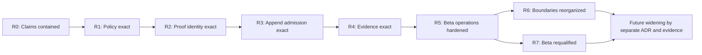

# AETHER Remediation Programme

- Date: 2026-07-09
- Baseline commit: `fd4c68db9f0232a18e930d42f55a30f1d74f6201`
- Status: execution-ready programme
- Sequence authority: binding for remediation work unless superseded by an
  accepted ADR
- Primary input: `docs/COMPREHENSIVE_AUDIT_2026-07-09.md`

## Executive Directive

Continue the central technical thesis.

Preserve:

- Rust as the authoritative semantic kernel
- the AETHER DSL as the canonical semantics surface
- deterministic journal replay
- SCC compilation and semi-naive fixed-point execution
- provenance-bearing derived tuples and explanations
- Go and Python as clients rather than semantic authorities

Repair, in this order:

1. policy must become semantic input rather than response filtering
2. explanation identity must become execution-scoped rather than process-local
3. append must become schema-admitted and atomic rather than validated during
   later replay
4. readiness must become a computation over immutable evidence rather than a
   declaration

Only after those four contracts are exact should AETHER broaden service
concurrency, security posture, crate boundaries, planner ownership, or product
claims.

This is a remediation programme, not a rewrite. Each phase must leave `main`
green, keep the journal authoritative, and make one durable contract stronger.

## Programme Outcome

The programme is complete when AETHER can defend this statement:

> For an exact namespace, schema, journal prefix, policy scope, DSL program,
> imported-cut set, and engine version, AETHER deterministically returns the
> same state, derivations, query results, and proofs; rejects invalid writes
> before they reach authority; and promotes a release claim only from verified
> evidence for the exact released commit and package.

Four invariants define that outcome.

### Policy noninterference

For policy scope `S`, if two authority/program inputs have the same projection
visible to `S`, every externally observable semantic artifact must be
identical:

```text
project(H1, S) == project(H2, S)
and project(P1, S) == project(P2, S)
    implies
observe(H1, P1, S) == observe(H2, P2, S)
```

The observable set includes state, errors, query rows, tuple numbering,
iterations, aggregates, source IDs, reports, and explanation traces.

The evaluation order is fixed:

```text
select authority prefix
    -> project raw inputs by policy
    -> resolve visible datoms
    -> compile visible program facts
    -> evaluate recursion, negation, and aggregation
    -> expose already-scoped results
```

No correctness-bearing path may filter semantic results after evaluation.

### Proof identity

Every externally resolvable proof is tied to one execution descriptor:

```text
ExecutionId = hash(
    namespace,
    authority cut,
    visible-prefix digest,
    schema digest,
    program digest,
    effective-policy digest,
    imported cuts and epochs,
    engine-semantics version
)
```

A client receives an opaque trace handle that resolves only inside that
execution. A bare `TupleId` is never a service-level proof identity.

### Append admission

A batch reaches journal authority only when all of these are true:

```text
active schema matches
and complete batch validates
and policy/provenance dependencies are closed
and current tail equals expected tail
and the batch commits atomically
```

Rejected batches leave journal history, cut, receipts, sidecars, and schema
state unchanged.

### Evidence-bound claims

```text
Ready(stage, candidate) =
    every required gate has valid passed evidence
    for the exact candidate commit, tree, package, inputs, and workflow run
```

Authored policy declares required gates. It never declares that those gates
passed.

## Non-Negotiable Programme Rules

1. Do not weaken or special-case recursion, provenance, or replay to make a
   service fix easier.
2. Do not implement policy with host-language rule callbacks.
3. Do not add another late-filter path as a transitional shortcut.
4. Do not delete or silently skip journal entries during migration.
5. Do not let an opaque trace handle act as authorization by possession.
6. Do not let a compatibility switch enable unvalidated append in a beta
   package.
7. Do not accept workflow YAML, a path on disk, a `latest` file, or a ledger
   status as evidence that a gate ran.
8. Do not retry semantic correctness tests into green.
9. Do not begin a broad crate reshuffle before the four core remediations are
   green.
10. Do not restore commercial-beta language before the final qualification
    gate in this document passes.

## Programme State Machine



No state may be skipped. Design and test-fixture work may run ahead in
parallel, but a dependent production path may not merge until its predecessor
gate is green.

## R0 — Contain Claims And Freeze Scope

### Objective

Stop known defects from being converted into stronger claims while the system
is repaired.

### Required changes

- Set `fixtures/release/commercial-readiness-ledger.json` back to
  `design_partner_alpha` as the active target.
- Mark commercial beta blocked on these non-waivable items:
  - policy-scoped semantic correctness
  - execution-scoped trace identity
  - transactional schema-valid append
  - immutable release evidence
  - dependency SBOM/vulnerability/license evidence
  - supported transport-security boundary
- Reopen the policy-aware portion of `docs/V1_CLOSEOUT.md` and
  `docs/SEMANTIC_COMPLIANCE_MATRIX.md`.
- Use this temporary external claim only:

  > Controlled single-node alpha with a real Rust semantic kernel, limited to
  > one visibility domain, trusted appenders, and explicitly supported
  > deployment boundaries.

- Keep GA blocked.
- Freeze feature broadening that touches policy, service execution, append,
  proof identity, or release claims.
- Rebase open feature PRs onto the repaired contracts instead of merging them
  into the defective boundary.
- Record every remediation item with the stable IDs in this document.

### Documentation set

- `docs/STATUS.md`
- `docs/V1_CLOSEOUT.md`
- `docs/SEMANTIC_COMPLIANCE_MATRIX.md`
- `docs/KNOWN_LIMITATIONS.md`
- `docs/ROADMAP.md`
- `docs/COMMERCIAL_RELEASE_READINESS.md`
- commercialization front-door material and the Pages site

### Exit gate: `programme.claims_contained`

- No maintained document says policy-aware v1 closure is complete.
- No maintained document or generated ledger says commercial beta is ready.
- The allowed alpha boundary is identical across status, roadmap, limitations,
  commercialization, and site source.
- The audit and this programme are discoverable from the roadmap/status set.
- Existing dirty worktree changes are separated deliberately from remediation
  commits; no user-owned change is swept into a programme PR accidentally.

### Rollback rule

Claim containment is forward-fix only. It may be replaced by a stronger
verified claim, never rolled back to an unsupported one.

## R1 — Make Policy A Semantic Input

### Objective

Make every policy-bearing service result a computation over a policy-projected
authority prefix and policy-projected program, so hidden input cannot change
visible truth or visible metadata.

### Governing ADR

Create `docs/ADR/0010-policy-scoped-semantic-snapshots.md` before changing
behavior. It must specify:

- public versus unrestricted scope
- physical authority cuts versus visible cuts
- `Current` and hidden/nonexistent `AsOf` behavior
- dependency closure for provenance, causal frontiers, and sequence anchors
- scoped program facts
- recursion, negation, and aggregation semantics
- cache identity and public metadata
- timing noninterference as an explicit non-claim

### R1.1 Canonical scope

Add a normalized, non-optional kernel type in `aether_ast`:

```rust
pub struct PolicyScope {
    context: PolicyContext,
}
```

Contract:

- `None` and an empty wire context become `PolicyScope::public()`.
- Missing policy never means unrestricted.
- A distinct, non-serializable unrestricted mode is allowed only for trusted
  kernel tests and migration tooling.
- Capabilities and visibilities are sorted and deduplicated before equality,
  hashing, caching, or audit.
- Redacted `Debug` implementations do not print privileged scope contents.

Replace the HTTP-only empty-context normalization with this canonical kernel
contract.

### R1.2 Cut, then project, then replay

Introduce typed replay/snapshot values in `aether_resolver`, conceptually:

```rust
pub struct ScopedReplay {
    datoms: Vec<Datom>,
    requested_view: TemporalView,
    visible_cut: Option<ElementId>,
    scope: PolicyScope,
}

pub struct ResolvedSnapshot {
    state: ResolvedState,
    requested_view: TemporalView,
    visible_cut: Option<ElementId>,
    scope: PolicyScope,
}
```

Required behavior:

1. For `AsOf(e)`, select the physical authority prefix through `e`.
2. Return the same public error for an invisible and nonexistent requested
   element.
3. Project that prefix by policy.
4. Replay only visible datoms.
5. Return the last visible element as public `as_of`, or `None` for an empty
   projection.

For `Current`, select the full physical history, project it, then replay. The
physical tail may be retained privately for exact recomputation but must not
appear in lower-privilege responses or audit views.

Rename unrestricted resolver methods explicitly. Authenticated service code
must not be able to call them accidentally.

### R1.3 Enforce policy-closed dependencies

Policy projection is valid only when visible records do not depend on hidden
records.

For each provenance parent, causal-frontier reference, sidecar anchor, imported
fact, and sequence anchor:

- the referenced record must precede the dependent record
- the dependent policy envelope must be at least as restrictive as every
  dependency envelope
- a protected child may depend on a public parent
- a public child may not depend on a protected parent

Scoped replay must fail closed with a typed policy-dependency error. R3 must
move the same validation to append admission so new violations never enter the
journal.

### R1.4 Scope program facts before compilation

Add a scoped compilation path in `aether_rules` and a non-forgeable wrapper in
`aether_plan`:

```rust
pub struct ScopedProgram {
    compiled: CompiledProgram,
    scope: PolicyScope,
}
```

Project `ExtensionalFact` values before validation and compilation. Invisible
facts must not affect:

- compiler success or error shape
- predicate population
- SCC/stratum planning
- negation
- aggregation
- derivation or tuple allocation

Rules are policy-neutral in the current DSL. If rule policy is added later,
rule projection must occur before safety checking and stratification.

### R1.5 Make runtime consume scoped types

Introduce a security-bearing runtime path that consumes a `ResolvedSnapshot`
and `ScopedProgram` and returns one `EvaluationBundle`:

```rust
pub struct EvaluationBundle {
    snapshot: ResolvedSnapshot,
    program: ScopedProgram,
    derived: DerivedSet,
}
```

Consequences:

- negation sees only visible relations
- recursive fixed points use only visible rows
- aggregates operate only on visible rows
- tuple IDs, predicate indexes, and iteration metadata are allocated inside
  the scoped execution
- query and explanation code cannot mix state/program/derived data from
  different scopes

Keep raw runtime evaluation only as an explicitly trusted policy-neutral
library API. `EvaluateProgramRequest` must either become internal/trusted or
accept raw authority inputs from which a scoped snapshot can be constructed.

### R1.6 Centralize evaluation

Add a single evaluation builder, initially in
`crates/aether_api/src/evaluation.rs`, used by:

- `current_state`
- `as_of`
- `run_document`
- named queries and inline explains
- reports and delta reports
- sidecar fact projection
- partition imports and federated execution

Delete semantic uses of:

- `filter_resolved_state`
- `filter_derived_set`
- `filter_trace`
- query-time policy filtering

A final defensive output assertion may remain, but it must fail closed and may
not construct semantics.

### R1.7 Evaluation key

Create a canonical internal evaluation key containing:

- namespace
- normalized policy-scope digest
- requested temporal view
- visible journal-prefix digest
- schema digest
- scoped program/document digest
- imported cuts, leader epochs, and imported-fact digests
- engine-semantics version

Use canonical encoding and an explicit cryptographic hash dependency. Never
key by tuple ID, principal alone, raw optional policy, or physical tail alone.
External identifiers remain opaque and do not reveal scope names, hidden cuts,
or digests.

First correctness release:

- clear provisional caches on append, promotion, schema change, or semantics
  version change

Steady-state release:

- use bounded per-namespace content-addressed caches
- allow hidden-only appends to reuse an unchanged public projection
- retain old immutable executions for exact historical explanation

### R1.8 Permanent adversarial suite

Create `crates/aether_api/tests/policy_noninterference.rs` and focused lower
level tests covering:

| Area | Mandatory cases |
| --- | --- |
| Scalar replay | hidden assert, overwrite, retract, release, expire |
| Set replay | hidden add/remove/retract and mixed public/protected values |
| Sequence replay | hidden insert/remove, public child of hidden anchor, protected child of public anchor |
| Temporal | `Current`, visible `AsOf`, hidden `AsOf`, nonexistent `AsOf`, empty visible projection |
| Negation | hidden extensional and derived lower-stratum facts cannot suppress public rows |
| Recursion | hidden edges cannot complete public paths or alter visible iteration counts |
| Aggregation | hidden rows do not change `count`, `sum`, `min`, or `max` |
| Compilation | hidden facts cannot change compiler errors or plan-visible facts |
| Metadata | visible cut, tuple IDs, indexes, iterations, counts, and errors are projection-local |
| Explanations | every parent/source ID is visible and trace shape is projection-local |
| Sidecars | hidden catalog records and projections cannot affect semantic output |
| Federation | hidden imports cannot affect local joins, negation, aggregates, recursion, reports, or traces |
| HTTP | token policy binds before snapshot creation; narrowing works; escalation fails |
| Persistence | in-memory and SQLite parity; Postgres parity in CI |
| Property | equal visible projections yield byte-equal semantic outputs except opaque handles |

Do not assert that broader scopes produce supersets. Negation means legitimate
results may disappear as scope widens.

### R1.9 Performance characterization

Measure 10k and 100k datoms at 0%, 10%, 50%, 90%, and 100% visibility across
`Current`, `AsOf`, recursion, negation, aggregates, in-memory, SQLite, and
scheduled Postgres.

Initial guardrails:

- all-public/unrestricted p95 no more than 15% slower than the accepted
  pre-remediation service baseline
- peak allocation no more than 25% higher at equal scale
- cache bytes and entry count bounded per namespace
- no performance exception may reintroduce output filtering

If projection allocation is too high, optimize with borrowed views, iterators,
incremental digests, or snapshots. Do not weaken semantics.

### Exit gate: `semantic.policy_noninterference`

- Every authenticated path constructs scoped input before replay or evaluation.
- The permanent adversarial matrix passes for in-memory and SQLite; Postgres
  parity passes in CI.
- Projection-equivalence property tests pass.
- No physical hidden tail, hidden count, hidden iteration, or hidden source ID
  appears in a lower-privilege response.
- Existing journals pass a policy-dependency scanner or are quarantined.
- The compliance matrix cites exact tests.
- Mixed-policy claims remain blocked until this gate is immutable evidence in
  R4.

### Rollback rule

Shadow-comparison with the old path is allowed during development. Once the new
path is promoted, rollback must disable mixed-policy service use or return to
read-only alpha. It must never silently restore late filtering.

## R2 — Make Explanations Execution-Scoped

### Objective

Make every proof resolve to the exact evaluation that created it, across later
runs, appends, restarts, namespaces, and policy changes.

R2 depends on R1's scoped snapshot and evaluation-key contract.

### Governing ADR

Create `docs/ADR/0011-execution-receipts-and-trace-handles.md` covering:

- execution identity
- opaque external handles
- authorization and policy binding
- persistence and retention
- replay verification
- federation identity
- cache/record lifecycle
- compatibility and endpoint sunset

### Target types

Keep kernel-local `TupleId`. Add service-layer types conceptually equivalent to:

```rust
pub struct ExecutionManifest {
    execution_id: ExecutionId,
    namespace: NamespaceId,
    journal_cut: JournalCut,
    schema_ref: SchemaRef,
    document_digest: Digest,
    compiled_program_digest: Digest,
    effective_policy_digest: Digest,
    engine_semantics_version: String,
    created_at_ms: u64,
}

#[serde(transparent)]
pub struct TraceHandle(String);

pub struct TraceRecord {
    handle: TraceHandle,
    execution_id: ExecutionId,
    local_tuple_id: TupleId,
    tuple_digest: Digest,
    trace_digest: Digest,
    trace: DerivationTrace,
}
```

Rules:

- `ExecutionId` is deterministic over the R1 evaluation descriptor.
- `TraceHandle` is a random, unguessable 256-bit external identifier.
- The handle encodes no readable namespace, policy, cut, or digest.
- A handle is a locator, not a bearer capability.
- Current authorization must permit the namespace and original effective
  policy before resolution.
- Federated execution manifests bind ordered partition cuts, leader epochs,
  prefix digests, and imported-fact digests.

### Execution store

Add an `ExecutionStore` trait with:

- in-memory implementation for tests and ephemeral library use
- SQLite implementation for the packaged service
- Postgres implementation or explicitly scoped local-metadata implementation
  for the Postgres journal mode

Persist the manifest, canonical inputs required for replay, issued trace
records, retention metadata, and digests. Derived proof metadata is not journal
authority; it may be rebuilt and digest-verified from the exact prefix.

The execution store must be included in backup/restore and have bounded
retention. Eviction returns an explicit expired result; it never aliases a new
execution.

### API migration

1. Shadow-write execution manifests and trace records while preserving old
   responses.
2. Compare stored trace digests with current inline traces in CI.
3. Add execution receipts and trace handles to Rust, HTTP, reports, Go, Python,
   TUI, and notebooks.
4. Add a handle-resolution endpoint.
5. Move every first-party client to handles.
6. Disable bare tuple explanation in pilot/beta configuration.
7. Return `409 ambiguous_tuple_reference` during transition, then `410` after
   sunset.
8. Remove `last_derived` only when every document/report/federated path is
   handle-backed.

Rows that cannot be safely explained must say so. Clients must never fall back
to “latest tuple with the same ID.”

### Mandatory tests

- `t1` from run A and `t1` from run B return distinct correct proofs.
- A pre-append handle still returns the pre-append proof after later appends.
- Handles survive SQLite/Postgres-mode restart and backup/restore.
- Equivalent scoped executions produce the same internal execution ID.
- External handles remain different/unpredictable where required.
- Cross-namespace, insufficient-policy, revoked-token, malformed-handle,
  expired-handle, corrupted-manifest, and incompatible-engine cases fail
  closed.
- Auth reload changes authorization decisions without mutating immutable proof
  records.
- Federated handles bind the expected partition cuts and epochs.
- Trace replay reproduces the stored tuple/trace digests.

### Exit gate: `semantic.trace_handle_identity`

- No public service path accepts bare `TupleId` as proof identity.
- Every explainable row/report result carries inline proof or a durable handle.
- No trace can alias after another run, append, namespace access, or restart.
- Retention and backup/restore behavior are documented and tested.
- Rust, Go, Python, TUI, reports, demos, and notebooks use the new contract.

### Rollback rule

Use expand/contract migrations. Once handles are exposed, preserve their
resolver and metadata across server rollback. If resolution cannot be
preserved, fail closed; never resurrect `last_derived` as fallback.

## R3 — Admit Only Schema-Valid Atomic Appends

### Objective

Keep `aether_storage` schema-agnostic while making every externally reachable
service write pass one canonical namespace schema and one atomic admission
decision before journal commit.

R3 reuses R1 policy-dependency closure and R2 cut/schema identity.

### Governing ADR

Create `docs/ADR/0012-namespace-schema-and-append-admission.md` covering:

- schema identity and canonical hashing
- one active beta schema per namespace
- append validation and optimistic concurrency
- provenance requirements
- migration/quarantine behavior
- partition replication receipts
- compatibility and raw-journal boundaries

### Beta schema posture

Use one immutable active schema revision per namespace for beta. Do not support
online mixed-schema history until a separate migration design is proven.

Represent it with:

```rust
pub struct SchemaRef {
    version: String,
    digest: Digest,
}

pub struct NamespaceSchemaRevision {
    schema_ref: SchemaRef,
    schema: Schema,
    predecessor: Option<SchemaRef>,
    compatibility: SchemaCompatibility,
    status: SchemaStatus,
}
```

The DSL remains canonical. A document's attribute declarations must hash to or
be proven exactly compatible with the active namespace schema. The document may
add intensional predicate/rule declarations, but it may not redefine journal
attribute semantics.

Type/class changes require new attribute IDs or an offline namespace-generation
migration with an immutable manifest. Compatible additive changes require an
explicit compare-and-swap activation.

### Append contract

Add:

```rust
pub struct AppendAdmissionRequest {
    schema_ref: Option<SchemaRef>,
    expected_cut: Option<JournalCutRef>,
    idempotency_key: Option<String>,
    datoms: Vec<Datom>,
}

pub struct AppendReceipt {
    batch_id: BatchId,
    schema_ref: SchemaRef,
    prior_cut: JournalCut,
    committed_cut: JournalCut,
    batch_digest: Digest,
    appended: usize,
}
```

A private `ValidatedAppendBatch` constructor enforces the complete admission
matrix before storage can receive a batch.

### Admission matrix

- active schema version and digest match
- every attribute exists
- every recursive `Value` matches `ValueType` exactly
- operation/class combination is valid
- sequence anchor shape and prior/batch existence are valid
- element IDs are unique in batch and history
- expected cut matches
- causal frontier and provenance parents precede the child
- R1 policy-dependency closure holds
- confidence is finite and within range
- required provenance fields and schema identity are present
- document schema is compatible with namespace schema
- idempotency-key reuse has the same batch digest

### Atomic compare-and-append

Extend the journal boundary with tail/cut identity and a transactionally
conditional append, conceptually:

```rust
fn append_if_cut(
    &mut self,
    expected: &JournalCutRef,
    batch: &ValidatedAppendBatch,
) -> Result<CommittedCut, JournalError>;
```

Flow:

1. Read an exact prefix and cut.
2. Validate prior state plus the whole batch.
3. Commit only if the cut is unchanged.
4. Return `409 stale_cut` or boundedly reread/revalidate on conflict.
5. Persist an append receipt with schema, cuts, principal, digest, and
   admission-engine version.

SQLite and Postgres must check the expected cut and insert in one transaction.
Postgres should reuse its namespace row lock. In-memory behavior must match.

### Cover every ingress

- service append
- partition/leader append
- follower catch-up
- seeds and bulk import
- recovery/migration tools
- future sidecar-to-journal projection

The leader produces the admission receipt. Followers verify and replicate that
receipt rather than making a second semantic decision.

No externally reachable path may call raw `Journal::append`.

### Existing-history migration

1. Put a namespace in read-only migration mode.
2. Scan its complete prefix against a candidate schema and R1 dependency rules.
3. If valid, seal a `SchemaBaselineReceipt` and enable writes.
4. If invalid, mark the generation quarantined. Do not skip or rewrite entries.
5. Repair by creating a new namespace generation with a migration receipt that
   records the source-prefix digest, mappings, and quarantined elements.
6. Preserve the original generation read-only.

Backup/restore must include schema revisions, activation state, append receipts,
execution records, and migration manifests.

### API and client migration

- Add schema discovery and admin registration/activation endpoints.
- Add append dry-run diagnostics.
- Make append responses return receipts.
- During one compatibility release, omitted schema ref binds to the active
  schema and emits deprecation metadata.
- Wrong/stale schema returns structured `409 schema_mismatch`.
- Beta configuration requires explicit schema preconditions and offers no
  unvalidated bypass.
- Add structured error codes while retaining the old human message during
  transition.
- Publish capability flags such as `trace_handles_v1`,
  `namespace_schema_ref_v1`, and `structured_errors_v1`.

### Mandatory tests

For in-memory, SQLite, and Postgres:

- unknown attribute
- wrong scalar/list/entity type
- invalid operation/class
- invalid or hidden sequence anchor
- duplicate elements
- missing/forward causal parents
- invalid confidence/provenance
- stale/wrong schema
- stale cut
- mixed valid/invalid batch
- idempotent retry
- concurrent append and schema activation
- restart and backup/restore
- partition leader/follower receipt equality

Every rejected case must prove history, cut, receipt count, sidecars, and schema
state are byte-for-byte unchanged.

### Exit gate: `storage.transactional_schema_append`

- Unknown/invalid data never reaches journal authority through a public path.
- Append validation and commit are linearizable across all backends.
- Existing histories are certified or visibly quarantined.
- Every committed batch has a durable receipt.
- No service request can redefine namespace attribute semantics.
- All clients use or correctly negotiate the new contract.

### Rollback rule

Expand/contract database migrations only. Emergency response is read-only,
never “accept unvalidated.” A bad schema activation is rolled back by freezing
writes and activating a compatible predecessor; journal history is never
deleted. Plain raw append remains a low-level storage API, not a service escape
hatch.

## R4 — Compute Readiness From Immutable Evidence

### Objective

Replace authored readiness with a small, common, fail-closed trust layer that
binds every gate to the exact candidate source tree, inputs, workflow run, and
package digest.

R4 may be designed in parallel after R1 identity stabilizes, but it cannot
produce a passing beta verdict until R1-R3 are green.

### Governing ADR

Create `docs/ADR/0013-immutable-release-evidence-and-claim-computation.md`.

It must distinguish:

- release policy from observed evidence
- official from local/diagnostic evidence
- immutable artifacts from convenience `latest` pointers
- failures from waivers
- package file manifests from dependency SBOMs
- beta from GA provenance requirements

### Canonical files

Add:

- `schemas/release/evidence-envelope.schema.json`
- `schemas/release/evidence-bundle.schema.json`
- `schemas/release/risk-waiver.schema.json`
- `fixtures/release/gate-policy.json`
- `scripts/release_evidence.py`
- `scripts/verify_release_evidence.py`
- focused deterministic and negative tests under `python/tests/`

The existing commercial ledger becomes requirement/owner/claim policy only.
Remove authored blocking-gate outcomes from its input contract.

### Evidence envelope

Every gate result records:

- schema version and unique evidence ID
- stable gate ID
- repository, full commit SHA, tree SHA, ref/tag, and `dirty=false`
- workflow file at commit, run ID, attempt, job ID, runner/host, and tool versions
- exact command, start/end time, exit code, and attempt history
- input names and cryptographic digests
- observed status and metrics
- output path, media type, byte size, and digest
- validity/expiry where applicable

Allowed observed statuses:

- `passed`
- `failed`
- `error`
- `skipped`

Only `passed` satisfies a gate. Remove `ready`, `accepted_risk`, and
`ci_blocking` from machine evidence. A waiver is a separate signed/scoped fact;
it never rewrites a failure to passed.

### Immutable bundle

Name official bundles by full SHA, run ID, and attempt:

```text
aether-release-evidence-<full-sha>-<run-id>-<attempt>.zip
```

The bundle manifest contains:

- candidate and policy identity
- digest of every evidence fragment
- computed stage verdict and blockers
- exact verifier version
- final package digest
- file-integrity manifest
- Rust, Go, and assembled-package SBOMs
- vulnerability/license/code-scan results
- recovery, performance, and soak evidence
- provenance/attestation references
- optional separately approved waiver references

`latest` may remain a user convenience. The verifier must reject it as an
authoritative release input.

### Fail-closed verifier

Reject:

- dirty, stale, wrong-tree, wrong-ref, or wrong-candidate evidence
- missing, skipped, expired, malformed, or unknown-schema results
- digest mismatch or altered artifact bytes
- wrong workflow/job/command/host/suite/baseline/threshold
- static workflow declarations without successful runs
- concealed fail-then-pass retries
- authored ledger status used as evidence
- invalid, expired, cross-candidate, or non-waivable waivers
- package/SBOM/attestation subject mismatch

Correctness, package identity, critical/high vulnerabilities, secret exposure,
and R1-R3 gates are non-waivable.

### Workflow architecture

Refactor shared checks into reusable workflows invoked by PR CI and Release
Readiness.

One release-candidate run must:

1. resolve an explicit candidate SHA
2. checkout it detached with persisted credentials disabled
3. verify `HEAD`, tree, ref, and clean state
4. run correctness, client, Postgres/container, security, performance,
   recovery, and soak jobs at that SHA
5. upload SHA-named evidence fragments
6. build the package once after source gates pass
7. scan that exact package
8. aggregate and independently verify all fragments
9. create the immutable evidence bundle
10. attach package/SBOM provenance
11. publish only through a protected release environment

Do not consume workflow YAML as evidence. If external checks are ever reused,
bind them through exact head SHA, run/job identity, conclusion, and artifact
digest.

### Required semantic gates

- `semantic.policy_noninterference`
- `semantic.trace_handle_identity`
- `storage.transactional_schema_append`
- `semantic.full_acceptance`
- `quality.rust_fmt_clippy_all_targets`
- `quality.go_boundary`
- `quality.python_boundary`

The first three are non-waivable and depend directly on R1-R3.

### Retry policy

- Semantic correctness never retries into green.
- Infrastructure retry records every attempt and classification.
- Performance uses a predeclared sample/variance rule.
- Fail-then-pass is `unstable` unless the policy explicitly classifies the
  first failure as infrastructure error.
- Waivers are candidate-specific, owner-approved, compensating-control backed,
  and expiring.

### Negative test suite

Prove the verifier rejects:

- stale SHA/tree and `dirty=true`
- missing evidence and skipped jobs
- modified artifact bytes
- future/expired timestamps
- wrong host, suite, baseline, or threshold
- `ci_blocking` and unknown status
- an existing workflow file that never ran
- static `status: ready` in policy input
- hidden retries
- invalid/non-waivable waivers
- SBOM missing a lockfile component
- package digest not matching the attested subject
- Capacity artifact nesting regression
- Pages deployed SHA differing from candidate SHA

The same sorted evidence set must produce byte-stable canonical verdict JSON.

### Exit gate: `release.evidence_integrity`

- The ledger contains requirements, not observed outcomes.
- One clean exact-SHA candidate run produces a complete bundle.
- Every fragment and output verifies independently.
- A fresh checkout can verify the downloaded bundle offline except for
  attestation identity lookup.
- Release Readiness has a successful GitHub run for that SHA.
- No official verdict depends on ignored local `artifacts/` state.

### Rollback rule

Run the old renderer and new verifier in parallel for one diagnostic cycle.
Only the new verifier may promote. Once authoritative, rollback may block all
promotion but may not restore authored readiness.

## R5 — Harden The Beta Service And Delivery Boundary

### Objective

Close the remaining beta-blocking security, concurrency, supply-chain, and
workflow gaps after the four central contracts are exact.

### R5.1 Real SBOM and supply-chain gates

- Rename the current output to `pilot-package-file-manifest.json`.
- Generate validated CycloneDX JSON or SPDX SBOMs for:
  - Rust workspace and `Cargo.lock`
  - Go modules and `go.sum`
  - final assembled package/container
- Include component name, version, package URL, license, hashes, and dependency
  graph.
- Add Rust advisory, license/source policy, Go vulnerability, supported code
  scanning, and final package/container scanning.
- Fail on unknown components/licenses according to an explicit exception
  policy.
- Add dependency update configuration for Cargo, Go, and GitHub Actions.
- Pin Actions and service/container images by immutable digest.
- Restrict workflow permissions and allowed Actions.
- Require protected-main review/check rules and a protected release
  environment.
- Preserve secret scanning and push protection.

Tool choices and versions must be pinned and recorded in evidence. The gate
contract matters more than a specific scanner brand.

### R5.2 Transport security

Commercial beta must either exclude remote Postgres/non-loopback HTTP or
support verified TLS. The target implementation is verified TLS.

Create `docs/ADR/0014-beta-transport-security.md` and implement:

- Postgres `verify_full` production default
- optional `verify_ca`
- explicit development-only plaintext for loopback
- no automatic downgrade
- CA and optional client certificate/key configuration
- non-secret TLS status fields
- HTTPS at trusted ingress or native TLS for non-loopback HTTP
- certificate rotation and two-CA transition procedure

Tests must cover trusted CA, hostname mismatch, untrusted/expired CA, mTLS,
plaintext downgrade rejection, rotation, and redaction. CI must exercise a real
TLS-enabled Postgres instance.

### R5.3 Namespace concurrency isolation

Replace the global namespace-store mutex with a directory that holds
independently lockable namespace handles.

Required behavior:

- directory lock only locates or creates a namespace handle
- synchronous kernel/storage work uses a bounded blocking executor
- operations serialize within one namespace but run concurrently across
  namespaces
- queue depth is bounded
- saturation returns structured `503 namespace_busy` with `Retry-After`
- audit writes use a bounded writer path rather than a global slow-I/O lock
- partition execution receives equivalent per-partition isolation
- no request uses `std::thread::spawn(...).join()`

Tests must prove a blocked namespace does not delay another namespace, health,
status, or auth reload; same-namespace ordering remains deterministic; overload
is bounded; initialization happens once; and panics/disconnects do not create
unbounded work.

### R5.4 API/client migration discipline

Adopt structured errors while retaining the human string for one transition:

```json
{
  "error": "human-readable message",
  "code": "schema_mismatch",
  "request_id": "...",
  "details": {}
}
```

Publish capability negotiation for trace handles, schema refs, append receipts,
and structured errors. Update Rust, Go, Python, TUI, reports, demos, and
notebooks in the same phase as each server contract. Track legacy endpoint and
omitted-schema use before removal.

### R5.5 Repair operational automation

- Fix Capacity Planning artifact layout and add a preflight directory assertion
  plus always-uploaded failure inventory.
- Rerun Capacity Planning and require a green capacity report/tracker.
- Rerun Pages for current candidate SHA.
- Embed source SHA/version in the site and verify deployed SHA.
- Run Release Readiness on GitHub; zero historical runs is not qualification.
- Keep capacity diagnostic unless a release claim explicitly depends on it.
- Replace retry-until-green performance behavior with recorded samples and a
  predeclared verdict rule.

### R5.6 Service resource controls

Add and evidence:

- request body limits
- document/rule/iteration limits
- operation timeouts and cancellation semantics
- per-namespace queue/concurrency limits
- execution-store quotas and retention
- trace/result pagination
- audit backpressure behavior
- rate limiting at the supported ingress boundary

Limits must produce typed, audited failures without partial semantic mutation.

### Exit gate: `service.beta_boundary`

- Standard SBOM, vulnerability, license, code, package, and secret gates pass.
- Package and SBOM provenance verify.
- Supported network paths use verified TLS or are explicitly loopback-only.
- Namespace contention and overload evidence pass.
- All first-party clients use the new contracts.
- Capacity, Pages, and exact-SHA Release Readiness are green.
- Resource limits fail safely and leave authority unchanged.

## R6 — Reorganize Boundaries Without Moving Semantics

### Objective

Make crate ownership match responsibility after the repaired contracts have
stabilized. R6 is required before broad v2 widening, but a narrowly scoped beta
may be requalified after R5 if the remaining R6 items are documented and do not
weaken the beta boundary.

### Recommended target crates

- `aether_service_core`: policy-scoped replay orchestration, schema catalog,
  execution receipts, append admission, and service traits without HTTP
- `aether_http`: HTTP/auth/audit/namespace routing over service traits
- `aether_sidecar`: artifact/vector contracts and local catalog
- `aether_partition`: authority partitions, federation, imports, and
  replication prototype
- `aether_perf`: benchmarks, drift, trends, and capacity planning
- `aether_pilot`: coordination DSL, reports, demos, and product proof packs

Use temporary re-exports to preserve callers. Move one responsibility per PR.
Do not move policy, validation, or trace logic back into `aether_api` adapters.

### Promote `aether_plan`

Make `aether_plan` own the executable compiler/runtime contract:

- SCC and stratum schedule
- extensional bindings
- delta-anchor strategy
- aggregate plan nodes
- provenance requirements
- engine/plan format version

Runtime should consume the plan rather than reconstruct scheduling from rules.
Parser AST remains separate from executable plan.

### Later pressure points

After correctness and ownership are stable:

- add cursor/stream/snapshot journal APIs while retaining vector compatibility
- add source spans and explicit extensional binding syntax before DSL modularity
- move performance history from loose artifacts into a durable trend store
- keep distributed truth, automatic election, quorum consensus, and remote
  sidecars out of this programme

### Exit gate: `architecture.boundaries_recovered`

- No catch-all crate owns unrelated kernel, HTTP, product, performance, and
  partition responsibilities.
- Dependency direction remains inward toward the Rust kernel.
- Runtime consumes a versioned executable plan.
- Compatibility tests prove moves did not change semantic output.
- Build time, dependency graph, and ownership are measurably clearer.

## R7 — Requalify Selected Commercial Beta

### Objective

Promote only one exact candidate whose complete evidence verifies independently.

### Candidate qualification sequence

1. Select a protected candidate SHA and immutable candidate identifier.
2. Verify R0-R5 gates are required by `gate-policy.json`.
3. Run all source correctness/client gates at that SHA.
4. Run in-memory, SQLite, TLS-Postgres, container, restart, recovery, soak, and
   policy/federation evidence.
5. Build the package once.
6. Generate file manifest and standard component/package SBOMs.
7. Scan and attest that exact package digest.
8. Aggregate the immutable evidence bundle.
9. Verify the bundle from a fresh checkout/environment.
10. Deploy Pages from the same SHA and verify its displayed SHA.
11. Perform protected release-environment approval.
12. Change the computed claim posture only after verification succeeds.

### Beta promotion matrix

| Gate | Waivable | Required result |
| --- | --- | --- |
| `semantic.policy_noninterference` | No | passed |
| `semantic.trace_handle_identity` | No | passed |
| `storage.transactional_schema_append` | No | passed |
| `semantic.full_acceptance` | No | passed |
| Rust/Go/Python quality | No | passed |
| SQLite/Postgres/container parity | No | passed |
| Transport security | No | passed |
| Package identity and SBOM completeness | No | passed |
| Critical/high vulnerability policy | No | passed |
| Backup/restore and rollback | No | passed |
| Namespace contention/resource limits | No | passed |
| Performance thresholds | Performance-only, expiring | passed or explicit waiver |
| Soak/operability | Operational-only, expiring | passed or explicit waiver |
| Pages/source-SHA consistency | No | passed |
| Evidence-bundle verification | No | passed |

### Claim progression

| State | Allowed claim |
| --- | --- |
| R0 contained | Controlled single-node alpha, one visibility domain, trusted appenders |
| R1-R3 green | Alpha requalified for mixed-policy, durable proof, and admitted writes within explicit deployment limits |
| R4-R5 green | Beta candidate; no sale/promotion claim until exact bundle verification |
| R7 green | Selected commercial beta for the supported package/network/schema boundary |
| GA | Still blocked on separate support, incident, signed promotion, platform distribution, and distributed-truth gates |

### Exit gate: `release.commercial_beta_requalified`

- One immutable bundle verifies for the exact candidate.
- Every non-waivable gate passed.
- Any allowed waiver is explicit, candidate-bound, owner-approved, and expiring.
- Package, SBOM, provenance, docs, site, and claim verdict name the same SHA.
- `STATUS`, closeout, compliance matrix, QA, limitations, roadmap, release docs,
  commercialization docs, and site state the same computed posture.
- An operator can deploy, validate, back up, restore, and explain the selected
  beta without using an unsafe compatibility path.

## Pull Request And Delivery Sequence

Keep PRs small enough to review semantic meaning. Every PR must be green at
merge; known-failure tests may be written locally first but may not be merged as
ignored permanent debt.

| PR | Phase | Primary outcome | Depends on |
| --- | --- | --- | --- |
| `R0-01` | R0 | claim containment and programme links | none |
| `R1-01` | R1 | ADR, normalized `PolicyScope`, scoped replay contract | R0 |
| `R1-02` | R1 | policy dependency closure and migration scanner | R1-01 |
| `R1-03` | R1 | scoped program/runtime bundle and adversarial core tests | R1-02 |
| `R1-04` | R1 | service/report/sidecar/federation migration and metadata tests | R1-03 |
| `R1-05` | R1 | policy performance/cache characterization | R1-04 |
| `R2-01` | R2 | execution/trace schemas and expand migrations | R1 gate |
| `R2-02` | R2 | handle API, durable store, replay verification | R2-01 |
| `R2-03` | R2 | Go/Python/TUI/report/notebook migration and tuple sunset | R2-02 |
| `R3-01` | R3 | schema catalog and history certification | R2 gate |
| `R3-02` | R3 | validator and compare-and-append across backends | R3-01 |
| `R3-03` | R3 | partition replication receipts and public-ingress closure | R3-02 |
| `R3-04` | R3 | client compatibility, quarantine, backup/restore | R3-03 |
| `R4-01` | R4 | evidence schemas, emitter, verifier, negative tests | R3 gate |
| `R4-02` | R4 | reusable exact-SHA workflows and immutable aggregation | R4-01 |
| `R4-03` | R4 | computed ledger/docs and official bundle publication | R4-02 |
| `R5-01` | R5 | real SBOM/scanners/action pinning/repository controls | R4 gate |
| `R5-02` | R5 | Postgres/HTTP transport boundary | R5-01 |
| `R5-03` | R5 | per-namespace concurrency and resource limits | R5-02 |
| `R5-04` | R5 | Capacity/Pages/retry repair and full client evidence | R5-03 |
| `R6-*` | R6 | responsibility-by-responsibility extraction and plan promotion | R5 gate |
| `R7-01` | R7 | exact candidate qualification and claim promotion | R0-R5 |

Do not combine R1, R2, and R3 into one mega-PR. Their invariants must be
reviewable independently.

## Cross-Phase Test And Evidence Map

| Defect class | Permanent gate | Minimum durable evidence |
| --- | --- | --- |
| Late policy filtering | `semantic.policy_noninterference` | adversarial suite, projection property tests, backend parity |
| Hidden metadata | `semantic.policy_noninterference` | visible-cut/iteration/source-ID golden results |
| Stale/aliased proof | `semantic.trace_handle_identity` | cross-run/append/restart/namespace/policy handle tests |
| Poison append | `storage.transactional_schema_append` | rejected-batch immutability and concurrent CAS tests |
| Self-authored readiness | `release.evidence_integrity` | verifier negative suite and exact-SHA bundle |
| Incomplete security gate | `service.beta_boundary` | standard SBOM, scans, package/provenance verification |
| Plaintext Postgres | `service.beta_boundary` | TLS integration and downgrade-rejection evidence |
| Global serialization | `service.beta_boundary` | cross-namespace contention and overload bundle |
| Capacity workflow | `service.beta_boundary` | green run with asserted artifact layout |
| Pages drift | `release.commercial_beta_requalified` | successful deployment displaying candidate SHA |

## Migration And Compatibility Policy

### Expand, migrate, enforce, contract

Every public/durable change follows this sequence:

1. add new fields/tables/endpoints without removing old readers
2. shadow-write and verify new records
3. migrate first-party clients
4. measure compatibility usage
5. enforce the safe contract in beta configuration
6. remove the unsafe path only after fixtures and migration docs exist

### Safe compatibility defaults

- Missing policy means public, never unrestricted.
- Missing schema ref may bind to the active schema for one deprecation release,
  but the server returns the actual ref and beta requires it explicitly.
- Missing trace handle means “not safely explainable,” never “look up latest
  tuple.”
- A failed schema migration means read-only quarantine, never dropped records.
- A TLS failure means startup/connection failure, never plaintext fallback.
- A verifier failure means no promotion, never hand-authored green status.

### Persistent-data rollback

- Never delete execution manifests, schema revisions, append receipts, or
  migration manifests during rollback.
- New binaries must tolerate older records through explicit format versions.
- Old binaries may run only if they ignore new derived metadata safely and do
  not bypass append admission.
- Once unsafe tuple explanation or unvalidated append is disabled, recovery is
  forward-fix or read-only mode.

## Resourcing And Parallelism

Recommended ownership lanes:

| Lane | Owns |
| --- | --- |
| Kernel semantics | R1 types, resolver, compiler, runtime, property tests |
| Service integrity | R2 execution store, R3 schema/admission, clients, concurrency |
| Release and security | R4 evidence trust layer, R5 supply chain/TLS/workflows |
| Independent review | ADR review, adversarial cases, evidence-verifier review, claim review |

The critical path is R0 → R1 → R2 → R3 → R4 → R5 → R7. Release-evidence
schema design, scanner evaluation, workflow repair, and client fixture design
may proceed in parallel, but cannot satisfy promotion early.

Order-of-magnitude effort, not a delivery commitment:

| Phase | Effort class | Likely concentrated work |
| --- | --- | --- |
| R0 | Small | days |
| R1 | Extra large | several engineering weeks |
| R2 | Large | multiple engineering weeks |
| R3 | Extra large | several engineering weeks |
| R4 | Extra large | several engineering weeks |
| R5 | Extra large | several engineering weeks |
| R6 | Extra large | staged after correctness; may span releases |
| R7 | Large | qualification and independent verification |

With three active lanes, R4 design and R5 tooling preparation can overlap R1-R3,
but the semantic critical path still makes this a multi-month programme rather
than a sprint.

## Risk Register

| Risk | Consequence | Control |
| --- | --- | --- |
| Policy fix changes existing answers | compatibility surprise | dual-run all-public equivalence plus explicit restricted-scope golden changes |
| Physical/visible cut confusion | temporal corruption or leak | ADR, typed cuts, hidden/nonexistent equivalence tests |
| Public record depends on hidden parent | broken projection | dependency-closure rule and migration scanner |
| Cache cardinality by policy combinations | memory exhaustion | observed scopes only, quotas, TTL/LRU, visible-prefix digests |
| Execution-store growth | disk exhaustion | retention policy, quotas, immutable receipt compaction |
| Canonical hash changes | handle/schema instability | versioned canonical serialization and engine/format version |
| Existing poisoned journal | replay outage | read-only certification, quarantine, immutable migration manifest |
| Schema evolution expands scope | endless R3 | one active beta schema; defer online mixed-schema history |
| Multi-process Postgres race | non-linearizable append | transactional expected-cut check under namespace lock |
| Client fallback to tuple ID | proof alias reintroduced | capabilities, typed clients, no fallback, endpoint sunset tests |
| Scanner/tool compromise | false security evidence | immutable pinning, least privilege, provenance, independent verification |
| Performance retry hides regression | false readiness | retain attempts, predeclared statistics, explicit instability state |
| Broad crate reorg obscures fixes | review failure | defer R6 and move one responsibility per PR |
| Feature PRs target old contracts | repeated conflicts | freeze/rebase after phase gates |

## Documentation Discipline

Each behavior-changing PR updates, as applicable:

- governing ADR
- `docs/STATUS.md`
- `docs/KNOWN_LIMITATIONS.md`
- `docs/ROADMAP.md`
- `docs/ARCHITECTURE.md`
- `docs/SEMANTIC_COMPLIANCE_MATRIX.md`
- `docs/V1_CLOSEOUT.md`
- `docs/QA.md`
- `docs/OPERATIONS.md`
- `docs/PILOT_DEPLOYMENT.md`
- `docs/PILOT_OPERATIONS_PLAYBOOK.md`
- `scripts/README.md`
- Rust/Go/Python API and migration documentation
- site/current-claim material

Current truth, future intent, and computed readiness must remain separate.
Generated claim summaries must identify their candidate SHA and evidence bundle.

## Grand Definition Of Done

The remediation endeavour is genuinely complete only when all of the following
are true:

- Policy projection occurs before replay, compilation, recursion, negation, and
  aggregation on every authenticated path.
- Equal visible projections produce equal observable semantic artifacts.
- Physical hidden cuts, counts, iterations, source IDs, and errors do not leak
  through lower-privilege responses.
- Every externally resolvable proof is execution-scoped, authorization-checked,
  durable for its declared retention period, and non-aliasing.
- Every externally reachable append is schema-valid, policy/provenance-valid,
  expected-cut checked, atomic, receipted, and backend-consistent.
- Existing journals are certified or quarantined without losing authority.
- The release ledger declares requirements only.
- Official readiness is computed from immutable exact-SHA evidence and can be
  independently verified.
- The package has a real dependency SBOM, passing vulnerability/license/code
  gates, verified provenance, and a supported transport-security boundary.
- Namespace contention and resource exhaustion are bounded and evidenced.
- Capacity, Pages, and Release Readiness are green for the selected candidate.
- Rust, Go, Python, TUI, reports, demos, notebooks, docs, and site agree on the
  same contracts and candidate.
- Selected commercial beta is restored only after the protected candidate
  bundle verifies.
- GA remains blocked until its separate support, incident, platform,
  distribution, signing, and distributed-truth requirements are actually met.

At that point AETHER will not merely have a coherent kernel. Its access policy,
proof identity, write authority, service boundary, and public claims will all be
derived from that kernel's central discipline: exact inputs, deterministic
meaning, explicit provenance, and independently verifiable evidence.

## First Execution Packet

The first implementation turn should stop at R0 plus the first narrow R1
vertical slice:

1. reconcile the existing dirty documentation scope without overwriting it
2. create a dedicated remediation branch/PR boundary
3. apply R0 claim containment
4. write ADR 0010
5. add the permanent policy noninterference test skeleton and fixtures
6. implement normalized `PolicyScope` and scoped replay for scalar
   `Current`/`AsOf`
7. make hidden-retract and visible-cut regressions green
8. run fmt, strict Clippy, full workspace tests, Go, Python, docs, and diff checks
9. update status/limitations/compliance evidence for only that completed slice
10. do not begin trace handles until the R1 scoped-snapshot contract is reviewed

That packet creates the foundation on which every later remediation depends.
